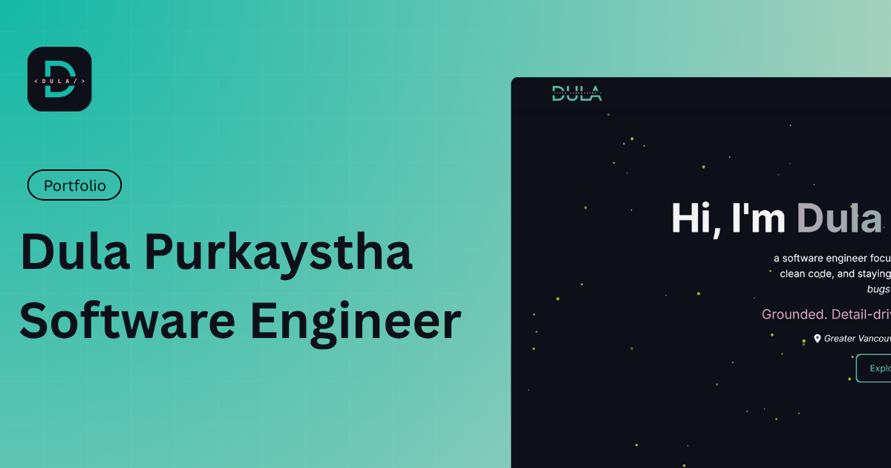

# Personal Portfolio | Dula Purkaystha

A modern, responsive developer portfolio built with Next.js, TypeScript, and Tailwind CSS to showcase my projects, technical skills, and creative work. Designed with a clean aesthetic, smooth animations, and a scalable code structure that I can continue expanding as my career grows.

## 🚀 Live Demo

[https://dula-purkaystha.vercel.app](https://dula-purkaystha.vercel.app)

## 📁 About This Project

This repository powers my personal portfolio site. A minimal, modern, and responsive website to showcase my projects, skills, and background. I built it to have a clean, professional presence online, combining modern web technologies with ease of maintenance.

### What it includes

- A sleek landing page with your name, bio, and contact info
- Sections for projects, skills, and background/experience
- Responsive design that works on mobile and desktop
- Easy-to-maintain codebase with TypeScript and tailwind for styling

## 🧑‍💻 Why I Built It

- To have a single, professional place where potential employers or collaborators can check out my work.
- To demonstrate my comfort and experience with modern web development tools (Next.js, TypeScript, Tailwind).
- To build something real that I can iterate on — and keep improving over time.

## ⚙️ Tech Stack

- **Next.js** – React framework for server-side rendering and static site generation
- **TypeScript** – Typed superset of JavaScript
- **Tailwind CSS** – Utility-first CSS framework for styling
- **Vercel** - Deployment & Hosting

## 🚀 Getting Started

To run this project locally:

```bash
# Clone the repo
git clone https://github.com/dpurkays/portfolio.git

# Change into project folder
cd portfolio

# Install dependencies
npm install       # or `yarn install`, if you use yarn

# Run dev server
npm run dev       # or `yarn dev`

# Build for production
npm run build     # then `npm run start` (or deploy as you prefer)
```
